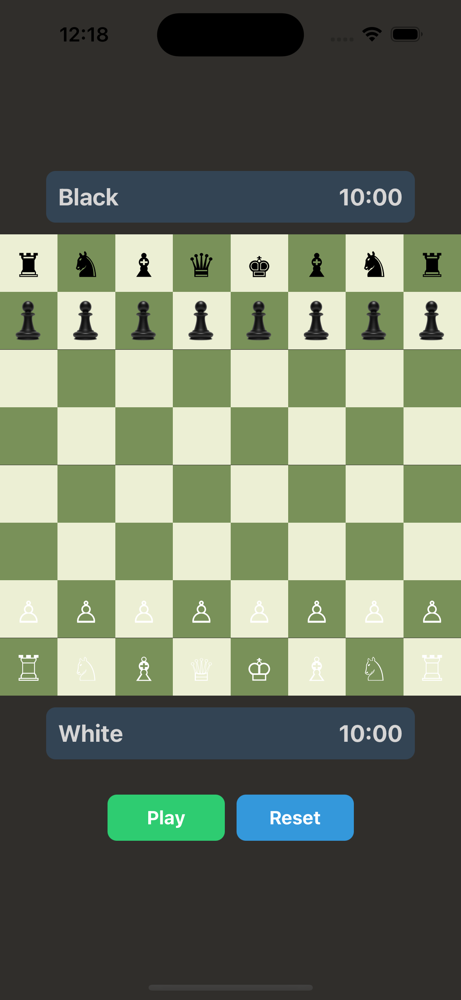

# React Native Chess Game

A fully functional chess game built with React Native, featuring real-time gameplay, piece movement validation, timer functionality, and game state management.

## 🎮 Features

- **Complete Chess Rules Implementation** using chess.js
- **Drag and Drop Piece Movement** with React Native Gesture Handler
- **Player Timer System**
    - 10-minute timer for each player
    - Automatic timer switching between turns
    - Timer pause/resume functionality
- **Game Controls**
    - Play/Pause functionality
    - Reset game option
    - Turn indicator
- **Game State Management**
    - Check/Checkmate detection
    - Stalemate detection
    - Draw conditions
    - Timer-based victories
- **Smooth Animations** using React Native Reanimated
- **Modern UI Design** with intuitive controls

## 📱 Screenshots



## 🛠️ Technologies Used

- React Native
- TypeScript
- chess.js
- React Native Gesture Handler
- React Native Reanimated

## 📋 Prerequisites

- Node.js >= 14
- npm or yarn
- React Native development environment set up

## ⚙️ Installation

1. Clone the repository:
```bash
git clone https://github.com/adityakmr7/chess-app
```

2.  Navigate to the project directory:
```bash
cd chess-app
```

3. Install dependencies:
```bash
npm install
# or
yarn install
```
4. Run the application:

# For iOS
npx react-native run-ios

# For Android
npx react-native run-android

## 📦 Dependencies
```json
{
  "chess.js": "^1.0.0",
  "react-native-gesture-handler": "^2.x.x",
  "react-native-reanimated": "^3.x.x"
}
```


## 🤝 Contributing

1. Fork the repository
2. Create your feature branch (git checkout -b feature/AmazingFeature)
3. Commit your changes (git commit -m 'Add some AmazingFeature')
4. Push to the branch (git push origin feature/AmazingFeature)
5. Open a Pull Request

📝 Future Improvements

- [ ] Move history tracking
- [ ] Game replay functionality
- [ ] Online multiplayer support
- [ ] Custom time controls
- [ ] Sound effects
- [ ] Piece promotion dialog
- [ ] Save/Load game state
- [ ] Undo/Redo moves

🐛 Known Issues

[List any known issues or limitations]

📄 License
This project is licensed under the MIT License - see the LICENSE.md file for details

👏 Acknowledgments

- Chess.js library for chess logic
- React Native Gesture Handler for drag and drop functionality
- React Native Reanimated for smooth animations

## 📧 Contact
Your Name - @adityakmr7
Project Link: https://github.com/adityakmr7/chess-app
